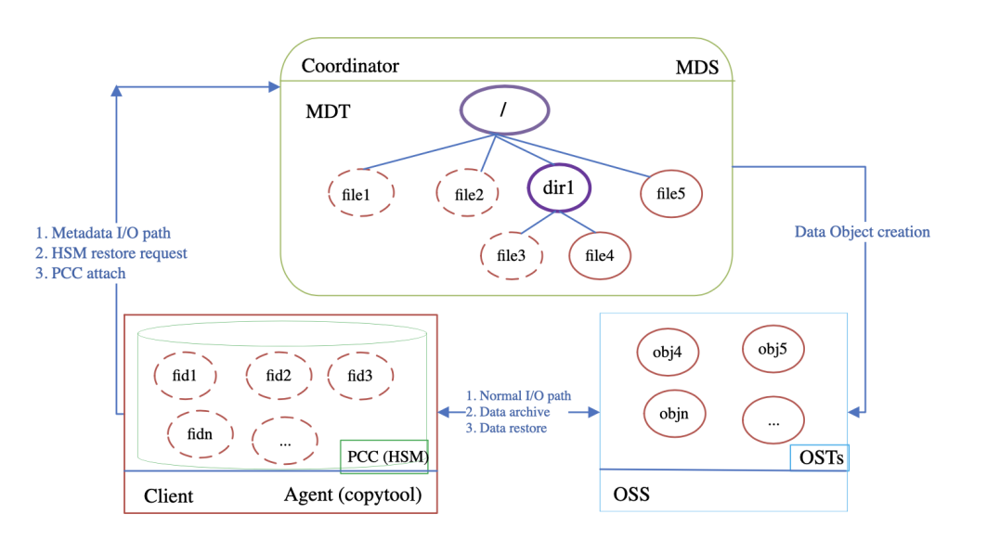

# Persistent Client Cache (PCC)

## 1. Introduction

Flash-based SSDs help to (partly) close the ever-increasing performance gap between magnetic disks and CPUs. SSDs build a new level in the storage hierarchy, both in terms of price and performance. The large size of data sets stored in Lustre, ranging up to hundreds of PiB in the largest centers, makes it more cost-effective to store most of the data on HDDs and only an active subset of data on SSDs.

The PCC mechanism allows clients equipped with internal SSDs to deliver additional performance for both read and write intensive applications that have node-local I/O patterns without losing the benefits of the global Lustre namespace. PCC is combined with Lustre HSM and layout lock mechanisms to provide persistent caching services using the local SSD storage, while allowing migration of individual files between local and shared storage. This enables I/O intensive applications to read and write data on client nodes without losing the benefits of the global Lustre namespace. 

The main advantages to use this cache on the Lustre clients is that the I/O stack is much simpler for the cached data, as there is no interference with I/Os from other clients, which enables performance optimizations. There are no special requirements on the hardware of the client nodes. Any Linux filesystem, such as ext4 on an NVMe device, can be used as PCC cache. Local file caching reduces the pressure on the object storage targets (OSTs), as small or random I/Os can be aggregated to large sequential I/Os and temporary files do not even need to be flushed to OSTs.

## 2. Design

### 2.1. Lustre Read-Write PCC Caching



Lustre typically uses its integrated HSM mechanism to interface with larger and slower archival storage using tapes or other media. PCC-RW, on the contrary, is actually an HSM backend storage system which provides a group of high-speed local caches on Lustre clients. Figure 27.1, “Overview of PCC-RW Architecture” shows the PCC-RW architecture. Each client uses its own local storage, usually in the form of NVMe, formatted as a local file system for the local cache. Cached I/Os are directed to files in the local file system, while normal I/ O are directed to OSTs.

PCC-RW uses Lustre's HSM mechanism for data synchronization. Each PCC node is actually an HSM agent and has a copy tool instance running on it. The Lustre HSM copytool is used to restore files from the local cache to Lustre OSTs. Any remote access for a PCC cached file from another Lustre client triggers this data synchronization. If a PCC client goes offline, the cached data becomes temporarily inaccessible to other clients. The data will be accessible again after the PCC client reboots, mounts the Lustre filesystem, and restarts the copytool.

Currently, PCC clients cache entire files on their local filesystems. A file has to be attached to PCC before I/O can be directed to a client cache. The Lustre layout lock feature is used to ensure that the caching services are consistent with the global file system state. The file data can be written/read directly to/from the local PCC cache after a successful attach operation. If the attach has not been successful, the client will simply fall back to the normal I/O path and direct I/Os to OSTs. PCC-RW cached files are automatically restored to the global filesystem when a process on another client tries to read or modify them. The corresponding I/O will be blocked, waiting for the released file to be restored. This is transparent to the application.

The revocation of the layout lock can automatically detach the file from the PCC cache at any time. The PCC-RW cached file can be manually detached by the lfs pcc detach command. After the cached file is detached from the cache and restored to OSTs, it will be removed from the PCC filesystem.

Failed PCC-RW operations usually return corresponding error codes. There is a special case when the space of the local PCC file system is exhausted. In this case, PCC-RW can fall back to the normal I/O path automatically since the capacity of the Lustre file system is much larger than the capacity of the PCC device.

### 2.2. Rule-based Persistent Client Cache

PCC includes a rule-based, configurable caching infrastructure that enables it to achieve various objectives, such as customizing I/O caching and providing performance isolation and QoS guarantees. 

For PCC-RW, when a file is being created, a rule-based policy is used to determine whether it will be cached. It supports rules for different users, groups, projects, or filenames extensions. 

Rule-based PCC-RW caching of newly created files can determine which file can use a cache on PCC directly without administrator's intervention.

## 3. PCC Command Line Tools

Lustre provides `lfs` and `lctl` command line tools for users to interact with PCC feature.

### 3.1 Add a PCC backend on a client

Command:

```
client# lctl pcc add mountpoint pccpath [--param|-p cfgparam]
```

The above command will add a PCC backend to the Lustre client.

| **Option** | **Description**                                              |
| ---------- | ------------------------------------------------------------ |
| mountpoint | The Lustre client mount point.                               |
| pccpath    | The directory path on local filesystem for PCC cache. The whole filesystem does not need to be exclusively dedicated to the PCC cache, but the directory should not be accessible to regular users. |
| cfgparam   | A string in the form of name-value pairs to config the PCC backend such as read-write attach id (archive ID), and auto caching rule, etc. |

**Note:** when a client node has more than one Lustre mount point or Lustre filesystem instance, the parameter `mountpoint` makes sure that only the PCC backend on specified Lustre filesystem instance or Lustre mount point is configured. This Lustre mount point must be the same as the HSM (lhsmtool_posix) configuration, if the PCC backend is used as PCC-RW caching. Also, the parameter `pccpath` should be the same as the HSM root parameter of the POSIX copytool (lhsmtool_posix).

PCC-RW uses Lustre's HSM mechanism for data synchronization. Before using PCC-RW on a client, it is still necessary to setup HSM on the MDTs and the PCC client nodes.

First, a coordinator must be activated on each of the filesystem MDTs. This can be achieved with the command:

```
mds# lctl set_param mdt.$FSNAME-MDT0000.hsm_control=enabled
mdt.lustre-MDT0000.hsm_control=enabled
```

Next, launch the copytool on each agent node (PCC client node) to connect to your HSM storage. This command will be of the form:

```
client# lhsmtool_posix --daemon --hsm-root $PCCPATH --archive=$ARCHIVE_ID $LUSTREPATH
```

Examples:

The following command adds a PCC backend on a client:

```
client# lctl pcc add /mnt/lustre /mnt/pcc --param "projid={500,1000}&fname={*.h5},uid=1001 rwid=2"
```

The first substring of the config parameter is the auto-cache rule, where "&" represents the logical AND operator while "," represents the logical OR operator. The example rule means that new files are only auto cached if either of the following conditions are satisfied: 

• The project ID is either 500 or 1000 and the suffix of the file name is "h5"; 

• The user ID is 1001; 

The currently supported name-value pairs for PCC backend configuration are listing as follows: 

• `rwid` PCC-RW attach ID which is same as the archive ID of the copytool agent running on this PCC node. 

• `auto_attach "auto_attach=1"` enables auto attach at the next open or during I/ O. Enabling this option should cause automatic attaching of valid PCC-cached files which were detached due to the manual `lfs pcc detach` command or revocation of layout lock (i.e. LRU lock shrinking). `"auto_attach=0"` means that auto file attach is disabled and is the default mode.

### 3.2 Delete a PCC backend from a client

**Command:**

```
lctl pcc del <mountpoint> <pccpath>
```

The above command will delete a PCC backend from a Lustre client.

| **Option** | **Description**                                              |
| ---------- | ------------------------------------------------------------ |
| mountpoint | The Lustre client mount point.                               |
| pccpath    | A PCC backend is specified by this path. Please refer to `lctl pcc` add for details. |

**Examples:**

The following command will delete a PCC backend referenced by `"/mnt/pcc"` on a client with the mount point of `"/mnt/lustre"`.

```
client# lctl pcc del /mnt/lustre /mnt/pcc
```

### 3.3. Remove all PCC backends on a client

**Command:**

```
lctl pcc clear <mountpoint>
```

The above command will remove all PCC backends on a Lustre client.

| **Option** | **Description**                |
| ---------- | ------------------------------ |
| mountpoint | The Lustre client mount point. |

**Examples:**

The following command will remove all PCC backends from a client with the mount point of `"/mnt/lustre"`.

```
client# lctl pcc clear /mnt/lustre
```

### 3.4.  List all PCC backends on a client

**Command:**

```
lctl pcc list <mountpoint>
```

The above command will list all PCC backends on a Lustre client.

| **Option** | **Description**                |
| ---------- | ------------------------------ |
| mountpoint | The Lustre client mount point. |

**Examples:**

The following command will list all PCC backends on a client with the mount point of `"/ mnt/lustre"`.

```
client# lctl pcc list /mnt/lustre
```

### 3.5.  Attach given files into PCC

**Command:**

```
lfs pcc attach --id|-i <NUM> <file...>
```

The above command will attach the given files onto PCC.

| **Option**      | **Description**                               |
| --------------- | --------------------------------------------- |
| --id\|-i \<NUM> | Attach ID to select which PCC backend to use. |

**Examples:**

The following command will attach the file referenced by `/mnt/lustre/test` onto the PCC backend with PCC-RW attach ID that equals 2.

```
client# lfs pcc attach -i 2 /mnt/lustre/test
```

### 3.6.  Attach given files into PCC by FID(s)

**Command:**

```
lfs pcc attach_fid --id|-i <NUM> --mnt|-m <mountpoint> <fid...>
```

The above command will attach the given files referenced by their FIDs into PCC.

| **Option**             | **Description**                               |
| ---------------------- | --------------------------------------------- |
| --id\|-i \<NUM>        | Attach ID to select which PCC backend to use. |
| --mnt\|-m\<mountpoint> | The Lustre mount point.                       |

**Examples:**

The following command will attach the file referenced by FID `0x200000401:0x1:0x0` onto the PCC backend with PCC-RW attach ID that equals 2.

```
client# lfs pcc attach_fid -i 2 -m /mnt/lustre 0x200000401:0x1:0x0
```

### 3.7.  Detach given files from PCC

**Command:**

```
lfs pcc detach [--keep|-k] <file...>
```

The above command will detach given files from PCC.

| **Option** | **Description**                                              |
| ---------- | ------------------------------------------------------------ |
| --keep\|-k | By default, the detach command will detach the file from PCC permanently and remove the PCC copy after detach.<br />This option will only detach the file, but keep the PCC copy in cache. It allows the detached file to be attached automatically at the next open if the cached copy of the file is still valid. |

**Examples:**

The following command will detach the file referenced by `/mnt/lustre/test` from PCC permanently and remove the corresponding cached file on PCC.

```
client# lfs pcc detach /mnt/lustre/test
```

The following command will detach the file referenced by `/mnt/lustre/test` from PCC, but allow the file to be attached automatically at the next open. 

```
client# lfs pcc detach -k /mnt/lustre/test
```

### 3.8.  Detach given files from PCC by FID(s)

**Command:**

```
lfs pcc detach_fid [--keep|-k] <mountpoint> <fid...>
```

The above command will detach the given files from PCC by FID(s).

| **Option** | **Description**                                        |
| ---------- | ------------------------------------------------------ |
| --keep\|-k | Please refer to the command lfs pcc detach for details |

**Examples:**

The following command will detach the file referenced by FID `0x200000401:0x1:0x0` from PCC permanently and remove the corresponding cached file on PCC.

```
client# lfs pcc detach_fid /mnt/lustre 0x200000401:0x1:0x0
```

The following command will detach the file referenced by FID `0x200000401:0x1:0x0` from PCC, but allow the file to be attached automatically at the next open.

```
client# lfs pcc detach_fid -k /mnt/lustre 0x200000401:0x1:0x0
```

### 3.9. Display the PCC state for given files

**Command:**

```
lfs pcc state <file...>
```

The above command will display the PCC state for given files.

**Examples:**

The following command will display the PCC state of the file referenced by `/mnt/lustre/`

```
client# lfs pcc state /mnt/lustre/test 
file: /mnt/lustre/test, type: readwrite, PCC file: /mnt/pcc/0004/0000/0bd1/0000/0002/0000/0x200000bd1:0x4:0x0, user number: 1, flags: 4
```

 If the file "/mnt/lustre/test" is not cached on PCC, the output of its PCC state is as follow: 

```
client# lfs pcc state /mnt/lustre/test 
file: /mnt/lustre/test, type: none
```

## 4. PCC Configuration Example

1. Setup HSM on MDT

   ```
   mds# lctl set_param mdt.lustre-MDT0000.hsm_control=enabled
   ```

2. Setup PCC on the clients

   ```
   client1# lhsmtool_posix --daemon --hsm-root /mnt/pcc --archive=1 /mnt/lustre < /dev/null > /tmp/copytool_log 2>&1
   client1# lctl pcc add /mnt/lustre /mnt/pcc "projid={1000},uid={500} rwid=1"
   
   client2# lhsmtool_posix --daemon --hsm-root /mnt/pcc --archive=2 /mnt/lustre < /dev/null > /tmp/copytool_log 2>&1
   client2# lctl pcc add /mnt/lustre /mnt/pcc "projid={1000}&gid={500} rwid
   ```

3. Execute PCC commands on the clients

   ```
   client1# echo "QQQQQ" > /mnt/lustre/test
   
   client2# lfs pcc attach -i 2 /mnt/lustre/test
   
   client2# lfs pcc state /mnt/lustre/test
   file: /mnt/lustre/test, type: readwrite, PCC file: /mnt/pcc/0004/0000/0bd1/0000/0002/0000/0x200000bd1:0x4:0x0, user number: 1, flags: 6
   
   client2# lfs pcc detach /mnt/lustre/test
   ```

   

